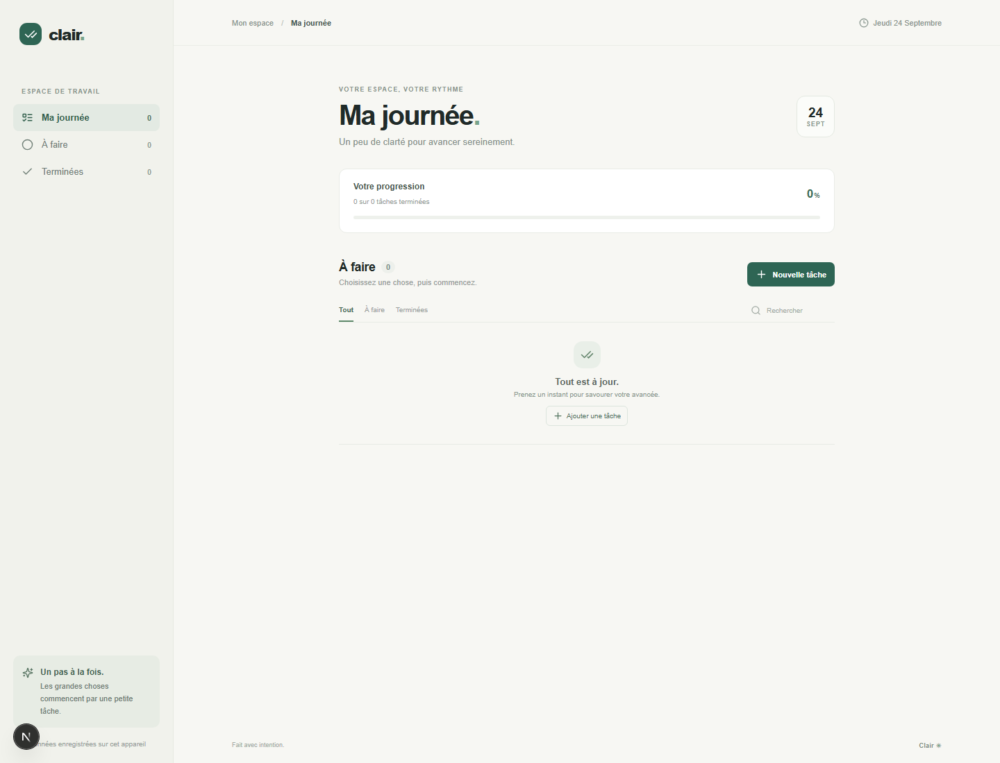
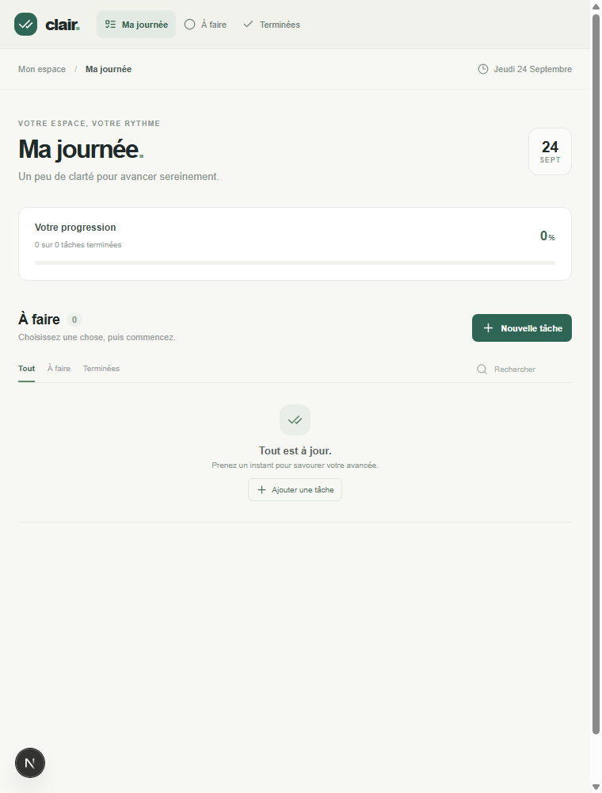

# Clair — To-Do List

Une refonte de l’application To-Do List : une interface claire, responsive et entièrement en français pour organiser sa journée sans distraction.

## Aperçu

| Ordinateur | Écran compact |
| --- | --- |
|  |  |

## Fonctionnalités

- Ajouter, modifier, terminer et supprimer des tâches
- Définir une priorité et une échéance
- Rechercher et filtrer les tâches
- Suivre sa progression et replier les tâches terminées
- Conserver les données dans le navigateur, avec reprise des tâches de l’ancienne version
- Mise en page adaptée au mobile et prise en compte de la préférence de réduction des animations

## Lancer l’application

Prérequis : Node.js et npm.

```bash
npm install
npm run dev
```

Ouvrez ensuite [http://localhost:3000](http://localhost:3000).

Les tâches sont stockées dans le `localStorage` du navigateur et ne sont pas synchronisées entre appareils.
